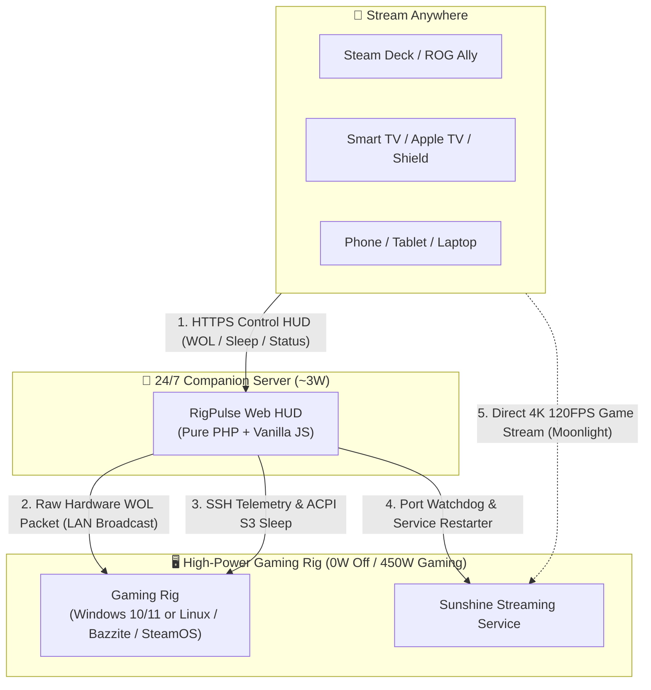

# RigPulse ⚡

<p align="center">
  <strong>The missing remote power & telemetry link for self-hosted cloud gaming rigs (Moonlight + Sunshine).</strong><br>
  <em>Keep your 500W PC at 0W, wake it in seconds, stream to any screen, monitor hardware vitals, and suspend it from your couch.</em>
</p>

<p align="center">
  
  
  
  
  
  
  
</p>

<p align="center">
  <a href="https://kouchy.github.io/rigpulse/demo/"></a>
  <a href="https://kouchy.github.io/rigpulse/"></a>
</p>

---

### 📱 Mobile-First Cyberpunk Interface

| 🔒 **Access Lock** | 🔴 **Server Offline (WOL)** | 🟢 **Server Online (Sunshine)** | 📈 **Live Diagnostics HUD** |
| :---: | :---: | :---: | :---: |
| <a href="docs/assets/screenshots/01_password_screen.png"></a> | <a href="docs/assets/screenshots/02_home_offline.png"></a> | <a href="docs/assets/screenshots/03_home_online_sunshine.png"></a> | <a href="docs/assets/screenshots/04_diagnostics_modal.gif"></a> |
| *Role-based authentication* | *One-tap Wake-on-LAN* | *Live controls & sysinfo* | *Animated telemetry & charts* |

> 💡 **Don't just look at screenshots**: **[Launch the Live Interactive Demo](https://kouchy.github.io/rigpulse/demo/)** directly in your browser. Test Wake-on-LAN simulation, S3 suspend, real-time hardware telemetry curves, and Sunshine watchdog with zero setup or hardware required.

---

## 🎮 The Vision: Your Personal, Private Cloud Gaming Station

Open-source game streaming has reached parity with—and in many ways surpassed—commercial cloud gaming services like GeForce NOW, Xbox Cloud Gaming, and PlayStation Remote Play. The combination of **[Sunshine](https://github.com/LizardByte/Sunshine)** (host) and **[Moonlight](https://moonlight-stream.org/)** (client) provides:

- **Zero recurring subscription fees**, zero queue times, and zero catalog restrictions.
- **Pure raw performance**: 4K HDR, 120+ FPS, AV1/HEVC encoding, and sub-5ms local network latency.
- **Universal compatibility**: Stream your entire game library (Steam, Epic, GOG, Game Pass, emulators) seamlessly to your Steam Deck, ROG Ally, iPad, Apple TV, living room TV, or smartphone.

### The Missing Link: The 500W Idle Dilemma

A modern high-end gaming desktop draws **70W to 120W doing absolutely nothing at idle**, and upwards of **450W to 600W under full gaming load**.

Leaving your PC running 24/7 just so you can stream whenever the mood strikes wastes **150€ to 250€ in electricity every year**, wears down liquid cooling pumps and fans, and turns your room into a heater. But if you turn the PC off:
1. Standard Wake-on-LAN packets are local broadcast frames that **cannot cross Internet gateways, subnets, or VPNs**.
2. Sunshine occasionally hangs after video driver updates, leaving you with an unresponsive **black screen** and no way to restart it without remote desktop tools that break display drivers.
3. Shutting down your PC completely closes all your open games, requiring a cold boot, user login, and manual launcher restarts every time.

### The Solution: RigPulse

**RigPulse is the lightweight companion platform that makes self-hosted cloud gaming reliable, effortless, and eco-friendly.**

Running 24/7 on an ultra-low-power companion device (such as a **3W Raspberry Pi**, an existing home server, or router), RigPulse acts as your remote gaming command center:



---

## 🎯 Real-World Scenarios

| Scenario | The Pain Point | The RigPulse Fix |
| :--- | :--- | :--- |
| **🛋️ Couch & Living Room Gaming** | Your gaming PC is in the office upstairs. You want to play on your 4K TV via Apple TV or Shield, but walking upstairs to turn it on and off breaks the console experience. | Tap **POWER ON** on your phone from the sofa. The PC wakes in 3 seconds. When you're done, tap **SLEEP** to suspend your rig without getting up. |
| **🎒 Handhelds on the Go** | You're in bed or traveling with a Steam Deck or ROG Ally. Leaving your home PC on all day consumes 100W idle, but Moonlight alone cannot wake a sleeping PC across subnets or WANs. | Connect via your public domain (direct HTTPS/DDNS) or home VPN, open RigPulse, and wake the PC on demand. Put it to sleep when you arrive at your destination. |
| **📺 Headless Rigs & Virtual Displays** | Your PC runs headless in a closet with a dummy HDMI plug or virtual display driver (*IddSampleDriver*). You have no physical monitor to see what the host OS is doing. | RigPulse gives you a full hardware dashboard (GPU temps, wattage, VRAM, and Sunshine health) without needing to attach a screen or fire up remote desktop. |
| **🚨 The "Black Screen" Rescue** | Sunshine occasionally crashes or freezes after a driver update. Launching RDP or TeamViewer from your phone disrupts Windows display drivers and breaks HDR. | RigPulse's watchdog displays live port states (RTSP 48010, HTTPS 47984, HTTP, Web UI) and lets you **Restart Sunshine** in 1 click over SSH without touching your display setup. |
| **🌱 Real Energy Savings** | A 3W Raspberry Pi costs **~6€/year** in electricity. A 100W idle gaming rig left running 24/7 costs **~180€/year**. | Keep your rig at **0W** when not in use. You save up to 175€/year while enjoying instant access whenever you want to play. |

---

## ⚡ Highlights

- **One-Tap Wake-on-LAN**: Broadcasts standard 102-byte UDP magic packets directly onto the target's physical Ethernet segment.
- **ACPI S3 Suspend vs. Full Shutdown**: Put your PC into S3 sleep (resumes your active game in **2 to 3 seconds**) or trigger a clean OS shutdown.
- **Sunshine Game Streaming Watchdog**:
    - Live TCP health checks for RTSP (48010), HTTPS API (47984), HTTP (47989), and Web UI (47990).
    - One-click service start, stop, and restart controls over SSH.
    - Live ping latency sparkline to verify network health before connecting.
- **Diagnostics Live Hardware Telemetry HUD**:
    - GPU Core Load %, VRAM allocation, Video Encoder usage, Fan speed %, Core Temp (°C), and Board Power (Watts via NVIDIA SMI).
    - CPU Load %, Clock frequency, Core Temp (°C), and Package Power (Watts via Intel/AMD RAPL).
    - Real-time disk and network interface throughput.
- **Synchronized Metric Curves**: Single toggle (`[ ⚡ METRIC: PWR ]` ⇄ `[ 🌡️ METRIC: TEMP ]`) dynamically swaps telemetry curves with crisp HiDPI rendering.
- **Zero-Scroll, Mobile-First Cyberpunk HUD**:
    - Designed specifically for smartphone screens (`100dvh` zero-scroll).
    - Multi-tier GPU rendering modes: **Eco Mode** (30 FPS universal default for desktop & mobile), **Light / UltraLight Mode** (0 FPS continuous overhead for battery savings), and **Heavy Mode** (120 FPS uncapped glow).
- **Security & Privacy by Design**:
    - Dual-tier RBAC (Gamer vs. Admin) with BCrypt-hashed password authentication.
    - Ed25519 key-only SSH bridge with forced-command lockdown support.
    - Strictly whitelisted operations (zero arbitrary command injection vectors).
    - Cryptographic CSRF tokens and atomic 30-second concurrency action locks.
    - 100% private and self-hosted: zero external telemetry, zero tracking, zero cloud dependencies.
- **Ultra-Lean Stack (Zero NPM / No Bloat)**:
    - Backend: Pure PHP 7.0–8.3+. Runs on any Linux server, Raspberry Pi, or NAS with minimal RAM usage (~15MB).
    - Frontend: 100% Vanilla ES Modules and CSS3. No build steps, no webpack, no node_modules.
    - Host Agents: Native scripts for Windows 10/11 (PowerShell) and Linux (SteamOS / Bazzite / Ubuntu / Arch) with zero third-party background services or compilation.

---

## 🚀 Quick Start

### 1. Server Setup (Raspberry Pi / Linux Companion)

Clone the repository and run the guided bootstrap wizard:

```bash
git clone https://github.com/kouchy/rigpulse.git /var/www/rigpulse
cd /var/www/rigpulse
php web/bootstrap.php
```

The interactive wizard configures your target machine settings, hashes **Gamer** and **Admin** passwords (BCrypt cost 12), generates an Ed25519 SSH keypair (`web/ssh/id_ed25519`), and writes a secured `web/config.php` (`0640`).

👉 *Detailed prerequisites, manual key generation, and network settings are available in the [Companion Server Setup Guide](https://kouchy.github.io/rigpulse/getting-started/#1-companion-server-setup).*

### 2. Configure Your Web Server (DocumentRoot `web/`)

Point your web server (`DocumentRoot`) to the `web/` subfolder:

```bash
# Quick local preview:
php -S 0.0.0.0:8000 -t web/

# Or using Docker Compose (host networking for Layer-2 WOL broadcast):
docker compose up -d
```

### 3. Target Host Agent Setup

RigPulse uses native, single-file scripts on the gaming rig without any third-party background daemons:

| Target Platform | Agent Script | Quick Overview & Guide Link |
| :--- | :--- | :--- |
| **🪟 Windows 10 / 11** | `backends/windows/rigpulse_agent.ps1` | Enable Windows OpenSSH Server, copy the script to `C:\ProgramData\ssh\`, and lock down `administrators_authorized_keys` with forced-command.<br>👉 **[Step-by-Step Windows Guide](https://kouchy.github.io/rigpulse/getting-started/#windows-host-setup)** |
| **🐧 Linux (SteamOS / Bazzite / Ubuntu / Arch)** | `backends/linux/rigpulse_agent.sh` | Install OpenSSH, copy script to `/usr/local/bin/`, configure passwordless `visudo` for power commands, and add key to `~/.ssh/authorized_keys`.<br>👉 **[Step-by-Step Linux Guide](https://kouchy.github.io/rigpulse/getting-started/#linux-host-setup)** |

---

## 📖 Full Documentation

Comprehensive documentation with detailed hardware setup, BIOS tuning, security architecture, and configuration guides is hosted on **[kouchy.github.io/rigpulse](https://kouchy.github.io/rigpulse/)**:

- 🎮 **[Interactive Live Demo](https://kouchy.github.io/rigpulse/demo/)**: Test the full web HUD, Wake-on-LAN simulation, and telemetry charts directly in your browser.
- 🚀 **[Getting Started Guide](https://kouchy.github.io/rigpulse/getting-started/)**: BIOS ACPI/WOL prerequisites, Windows OpenSSH lockdown, Linux sudoers, and firewall rules.
- 🏛️ **[System Architecture](https://kouchy.github.io/rigpulse/architecture/)**: In-depth look at the 24/7 companion model, SSH cryptographic boundary, and zero-scroll rendering pipeline.
- ⚙️ **[Configuration Reference](https://kouchy.github.io/rigpulse/configuration/)**: Complete breakdown of every setting in `config.php` (client timers, thresholds, roles).
- 📜 **[Agent Protocol Specification v1.0](https://kouchy.github.io/rigpulse/agent-protocol/)**: JSON API schema, subcommands, and guidelines for writing custom host agents.
- 🔧 **[FAQ & Troubleshooting](https://kouchy.github.io/rigpulse/troubleshooting/)**: Solutions for Wake-on-LAN routing across subnets, Sunshine crashes, GPU power telemetry after sleep, and SSH permissions.

---

## 📄 License

RigPulse is open-source software licensed under the [MIT License](LICENSE).
