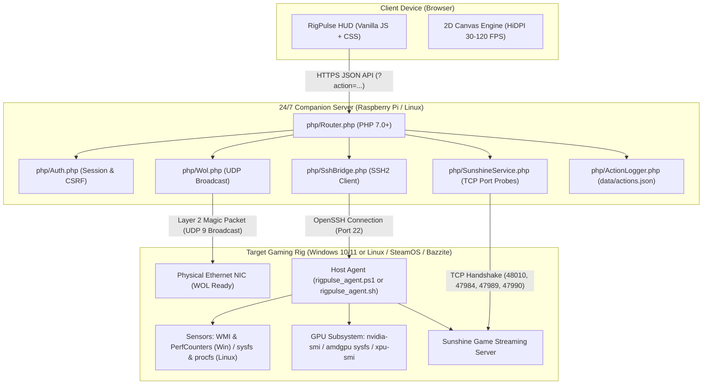

# Architecture & Design

RigPulse is built upon a distributed, energy-conscious client-server-agent architecture designed to minimize background power consumption and network overhead.

---

## 🏗️ System Overview



---

## 🔒 Security Architecture & Threat Model

When managing high-value gaming hardware and remote power states, security cannot be an afterthought. RigPulse is engineered from the ground up around strict defense-in-depth principles:

### 1. Zero Inbound Exposure on the Gaming Rig
- **No Web Server on the Host**: Your gaming PC never runs a public web server, PHP engine, or management daemon exposed to the Internet.
- **Local-Only Communication**: The target PC only listens for SSH on your private local network (LAN).
- **Companion Isolation**: Only the lightweight companion server (e.g., a Raspberry Pi) handles web traffic, isolating your primary gaming workstation behind your local firewall.

### 2. Key-Based Cryptographic SSH Bridge & Forced Command Lockdown
- **No Passwords on the Wire**: RigPulse authenticates to the host machine strictly using modern **Ed25519 (or RSA-4096)** public-key cryptography. No host credentials or user account passwords (Windows or Linux) are ever stored on disk or sent across the network.
- **Forced Command Lockdown**: The target's `authorized_keys` can be strictly locked down to only execute the agent script:

=== "Windows 10 / 11"

    ```text
    command="powershell.exe -ExecutionPolicy Bypass -NonInteractive -File C:\ProgramData\ssh\rigpulse_agent.ps1",no-port-forwarding,no-X11-forwarding,no-agent-forwarding,no-pty ssh-ed25519 <PUBLIC_KEY> rigpulse-bridge
    ```

=== "Linux (SteamOS / Bazzite / Ubuntu / Arch)"

    ```text
    command="/usr/local/bin/rigpulse_agent.sh",no-port-forwarding,no-X11-forwarding,no-agent-forwarding,no-pty ssh-ed25519 <PUBLIC_KEY> rigpulse-bridge
    ```

Even if the companion server's SSH key were somehow compromised, an attacker cannot open an interactive shell, forward ports, or execute unauthorized binaries.

### 3. Strictly Whitelisted Operations (Zero Command Injection)
- The web application **never** passes arbitrary user commands or shell strings to SSH.
- Every API endpoint is mapped to hardcoded, static internal actions (`sleep`, `shutdown`, `reboot`, `sunshine_ctl`, `sysinfo`, `diagnostics`).
- All process parameters are strictly sanitized and escaped with PHP's native `escapeshellarg()`.

### 4. Role-Based Access Control (RBAC) & Hardened Auth
- **Gamer Role**: Allows waking the rig (WOL), putting it to sleep (S3), and checking Sunshine stream availability—ideal for family members or shared handheld gaming devices (Steam Deck, ROG Ally) and living room TVs.
- **Admin Role**: Unlocks full hardware diagnostic telemetry (CPU/GPU load, temps, power, fan speeds, active processes), Sunshine service restarts, and OS reboots.
- **BCrypt Password Storage**: Passwords are never stored in plaintext; they are hashed using **BCrypt** with an adaptive cost factor of 12.
- **Brute-Force Lockout**: Automatic 5-minute sliding window lockout after 5 consecutive failed authentication attempts.
- **Hardened Sessions**: Session cookies are configured with `HttpOnly`, `SameSite=Strict`, and `Secure` flags when served over HTTPS.

### 5. CSRF Protection & Concurrency Action Mutex
- **Cryptographic CSRF Tokens**: All state-changing operations (`POST`) mandate a session-tied `X-CSRF-Token` validated using constant-time `hash_equals()`.
- **Atomic Action Mutex**: A 30-second atomic lock prevents conflicting simultaneous power operations (e.g., waking and sleeping at the exact same moment from two different devices). Conflicting power requests from other client IPs return HTTP `409 Conflict`, preventing accidental machine thrashing.
- **Tamper-Evident Audit Log**: Every power command and service toggle is logged with timestamp, client IP, and role in `web/data/actions.json`.

### 6. 100% Private, Self-Hosted & Zero External Telemetry
- **Zero Third-Party Cloud Dependencies**: RigPulse operates completely offline on your local network or across your personal VPN (WireGuard, Tailscale).
- **Zero Tracking**: No Google Analytics, no tracking pixels, no telemetry phone-home, and no external CDN dependencies.
- **Hardware Telemetry Stays on Your LAN**: All hardware vitals (CPU/GPU temps, wattage, processes) are processed purely in-memory and streamed directly to your browser without intermediate third-party servers.

---

## ⚡ Performance Optimization

### Fast-Path In-Memory Agent Execution

Telemetry collection is engineered for minimal sampling latency and zero background CPU impact on both supported platforms:

- **Windows Fast-Path (<80ms)**:
  - Traditional remote WMI queries take 700ms to 1200ms. RigPulse bypasses WMI overhead by reading pre-cached instances of `[System.Diagnostics.PerformanceCounter]` and using tokenized structured `nvidia-smi` queries.
  - Formats JSON payloads entirely in-memory, dropping round-trip sampling time from ~800ms down to **<80ms**.
- **Linux Fast-Path (<30ms)**:
  - Directly reads raw kernel interfaces (`/sys/class/drm/card*/device/`, `/proc/stat`, `/proc/meminfo`, `/sys/class/hwmon`) with zero subprocess fork overhead.
  - Zero-config AMD Radeon monitoring without requiring the massive 15 GB ROCm SDK.
  - Achieves ultra-low round-trip latency of **<30ms**.

### Canvas Frame Rate Throttling
- **Eco Mode (Universal default)**: Smooth ~30 FPS capped rendering with soft neon glow, keeping client CPU/GPU utilization under 1% on laptops, handhelds, and phones.
- **Light & UltraLight Mode (Battery Saver)**: Cancels continuous `requestAnimationFrame` loops entirely (0 FPS continuous overhead); charts settle instantly upon data arrival.
- **Heavy Mode (Enthusiast)**: Uncapped 120 FPS render loop with dynamic glowing neon drop-shadows and real-time crosshair tracking.
