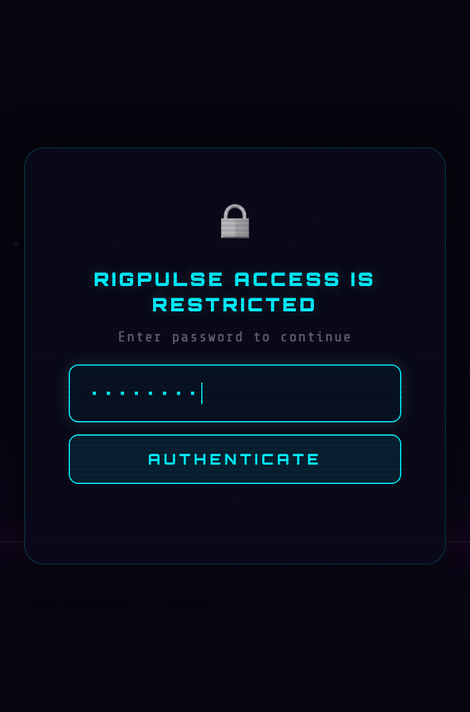
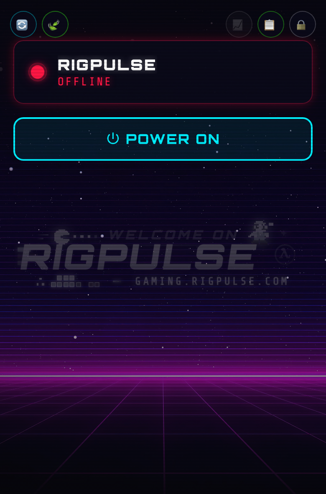
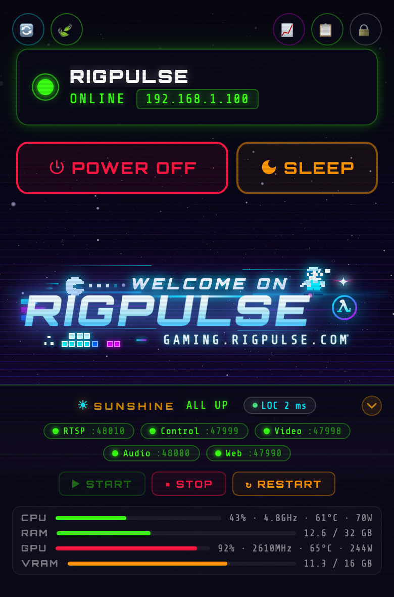
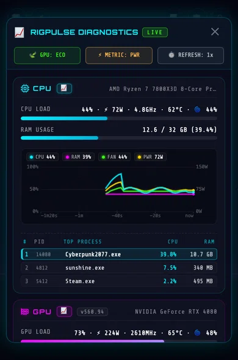
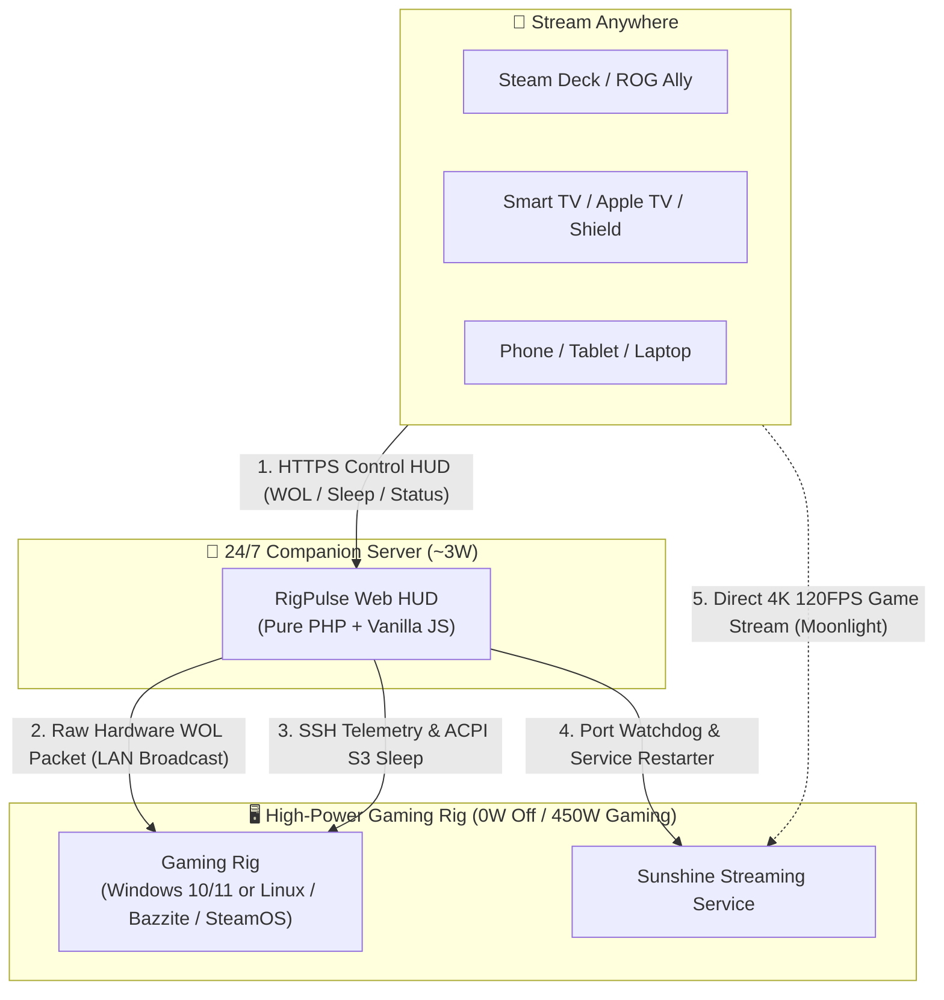

# RigPulse ⚡

**RigPulse** is the dedicated, ultra-lean remote power management platform and real-time diagnostic HUD designed for **self-hosted cloud gaming rigs (Moonlight + Sunshine)** and high-power workstations.

Built with a cyberpunk console aesthetic and an obsessive focus on low energy consumption, RigPulse bridges the gap between high-performance desktop hardware and mobile streaming clients—allowing you to keep your 500W PC powered off at 0W, wake it in seconds from your couch or across the globe, stream games to any screen, monitor hardware vitals, and suspend it back to ACPI S3 sleep when your session ends.

---

### 📱 Mobile-First Interface Preview

| 🔒 **Access Lock** | 🔴 **Server Offline (WOL)** | 🟢 **Server Online (Sunshine)** | 📈 **Live Diagnostics HUD** |
| :---: | :---: | :---: | :---: |
|  |  |  |  |
| *Role-based authentication* | *One-tap Wake-on-LAN* | *Live controls & sysinfo* | *Animated telemetry & charts* |

---

## 🎮 The Vision: Your Personal, Private Cloud Gaming Station

Open-source game streaming has reached parity with—and in many ways surpassed—commercial cloud gaming services like GeForce NOW, Xbox Cloud Gaming, and PlayStation Remote Play. The combination of **[Sunshine](https://github.com/LizardByte/Sunshine)** (host) and **[Moonlight](https://moonlight-stream.org/)** (client) provides:

- **Zero recurring subscription fees**, zero queue times, and zero catalog restrictions.
- **Pure raw performance**: 4K HDR, 120+ FPS, AV1/HEVC encoding, and sub-5ms local network latency.
- **Universal compatibility**: Stream your entire game library (Steam, Epic, GOG, Game Pass, emulators) seamlessly to your Steam Deck, ROG Ally, iPad, Apple TV, living room TV, or smartphone.

### The Problem: The 500W Idle Dilemma

A modern high-end gaming desktop draws **70W to 120W doing absolutely nothing at idle**, and upwards of **450W to 600W under full gaming load**.

Leaving your PC running 24/7 just so you can stream whenever the mood strikes wastes **150€ to 250€ in electricity every year**, wears down liquid cooling pumps and fans, and turns your room into a heater. But if you turn the PC off:

1. Standard Wake-on-LAN packets are local broadcast frames that **cannot cross Internet gateways, subnets, or VPNs**.
2. Sunshine occasionally hangs after video driver updates, leaving you with an unresponsive **black screen** and no way to restart it without remote desktop tools that break display drivers.
3. Shutting down the PC completely closes all your open games, requiring a cold boot, user login, and manual launcher restarts every time.

### The Solution: RigPulse

**RigPulse is the lightweight companion platform that makes self-hosted cloud gaming reliable, effortless, and eco-friendly.**

Running 24/7 on an ultra-low-power companion device (such as a **3W Raspberry Pi**, an existing home server, or router), RigPulse acts as your remote gaming command center:

!!! important "LAN Wake-on-LAN Requirement"
    Wake-on-LAN magic packets are layer-2 Ethernet broadcast frames that cannot cross standard Internet routers or WAN gateways without complex directed broadcast routing. Therefore, **having an always-on companion device (like a Raspberry Pi or NAS) connected to the same physical local area network as your target PC is an essential prerequisite**.

---

## 🎯 Real-World Scenarios

| Scenario | The Pain Point | The RigPulse Fix |
| :--- | :--- | :--- |
| **🛋️ Couch & Living Room Gaming** | Your gaming PC is in the office upstairs. You want to play on your 4K TV via Apple TV or Shield, but walking upstairs to turn it on and off breaks the console experience. | Tap **POWER ON** on your phone from the sofa. The PC wakes in 3 seconds. When you're done, tap **SLEEP** to suspend the rig without getting up. |
| **🎒 Handhelds on the Go** | You're in bed or traveling with a Steam Deck or ROG Ally. Leaving your home PC on all day consumes 100W idle, but Moonlight alone cannot wake a sleeping PC across subnets or WANs. | Connect via your public domain (direct HTTPS/DDNS) or home VPN, open RigPulse, and wake the PC on demand. Put it to sleep when you arrive at your destination. |
| **📺 Headless Rigs & Virtual Displays** | Your PC runs headless in a closet with a dummy HDMI plug or virtual display driver (*IddSampleDriver*). You have no physical monitor to see what the host OS is doing. | RigPulse gives you a full hardware dashboard (GPU temps, wattage, VRAM, and Sunshine health) without needing to attach a screen or fire up remote desktop. |
| **🚨 The "Black Screen" Rescue** | Sunshine occasionally crashes or freezes after a driver update. Launching RDP or TeamViewer from your phone disrupts Windows display drivers and breaks HDR. | RigPulse's watchdog displays live port states (RTSP 48010, HTTPS 47984, HTTP, Web UI) and lets you **Restart Sunshine** in 1 click over SSH without touching your display setup. |
| **🌱 Real Energy Savings** | A 3W Raspberry Pi costs **~6€/year** in electricity. A 100W idle gaming rig left running 24/7 costs **~180€/year**. | Keep your rig at **0W** when not in use. You save up to 175€/year while enjoying instant access whenever you want to play. |

---

## ⚡ Core Features

- **Wake-on-LAN Magic Packet Transmitter**: Direct UDP broadcast frames sent via native PHP sockets or CLI `wakeonlan`.
- **ACPI S3 Suspend vs. Clean Shutdown**: Instant suspend-to-RAM via native OpenSSH key-based bridge (resumes active games in **2 to 3 seconds**).
- **Sunshine Game Streaming Integration**:
    - Live TCP health probes for RTSP (48010), HTTPS API (47984), HTTP (47989), and Web UI (47990).
    - One-click service start, stop, and restart controls over SSH.
    - Live ping latency sparkline to verify host responsiveness.
- **Diagnostics Live Hardware Telemetry HUD**:
    - Live CPU Load %, Frequency, Core Temperature (°C), and Package Power (Watts via RAPL).
    - Live GPU Core Load %, VRAM allocation, Video Encoder usage, Fan speed %, Core Temperature (°C), and Board Power (Watts via NVIDIA SMI).
    - Real-time disk I/O throughput (MB/s Read/Write) and filesystem capacity.
    - Real-time network interface throughput (MB/s Recv/Sent).
    - Top 3 foreground and background processes sorted by CPU / RAM consumption.
- **Synchronized Metric Curves**: Single toggle (`[ ⚡ METRIC: PWR ]` ⇄ `[ 🌡️ METRIC: TEMP ]`) dynamically swaps chart datasets between Power (W) and Temperature (°C) with HiDPI curves and auto-scaling axes.
- **Zero-Scroll, Mobile-First HUD**:
    - Engineered specifically for handheld and mobile screens (`100dvh` zero-scroll).
    - Three GPU rendering tiers: **Eco Mode** (30 FPS universal default for desktop & mobile), **Light / UltraLight Mode** (0 FPS continuous overhead for battery savings), and **Heavy Mode** (120 FPS uncapped neon glow).
- **Security & Concurrency**:
    - BCrypt-hashed Gamer and Admin role authentication.
    - Action mutex locking to prevent conflicting simultaneous power actions.
    - Cryptographic CSRF tokens on all state-changing endpoints.
    - Persistent JSON audit history log with timestamped event tracking.

---

## 🛡️ Security & Privacy at a Glance

RigPulse is engineered around defense-in-depth principles to keep your high-power workstation and private LAN secure:

- **Zero Host Exposure**: The gaming rig runs no public web server and accepts no inbound Internet traffic; it only communicates over your private local network via SSH.
- **Key-Only SSH Bridge**: Authenticates strictly via Ed25519 public keys with optional `forced-command` lockdown (zero interactive shell access).
- **Strict Command Whitelist**: Zero arbitrary command execution or user-supplied shell strings; every operation maps to static, hardcoded internal routines.
- **Dual-Tier RBAC**: Distinct Gamer (WOL/Sleep/Stream check) vs. Admin (Diagnostics/Reboot) roles protected by BCrypt hashing and cryptographic CSRF tokens.
- **100% Private & Self-Hosted**: Zero cloud dependencies, zero external telemetry, zero analytics, and zero CDN tracking scripts.

👉 **[Explore the Complete Security Architecture & Threat Model →](architecture.md#security-architecture-threat-model)**

---

## 🛠️ Technology Stack

RigPulse is built with pure, unbloated technologies for maximum portability and longevity:

| Component | Technology | Rationale |
| :--- | :--- | :--- |
| **Server Backend** | **PHP 7.0–8.3+** | Runs natively on Apache, Nginx, or Lighttpd on any Linux distribution (Raspberry Pi OS, Debian, Ubuntu, Alpine) without compilation. |
| **Frontend UI** | **Vanilla HTML5, CSS3 & JavaScript** | Zero Node.js / NPM runtime build dependencies. Instant sub-millisecond page loads. |
| **Chart Visualizer** | **HTML5 Canvas 2D** | Custom HiDPI canvas engine supporting sub-pixel sliding curves and micro-second tooltips. |
| **Host Agents** | **PowerShell (Windows) & Bash / POSIX (Linux)** | Native host scripts without third-party background daemons or compilation. Fast zero-overhead execution. |

---

## 📚 Next Steps

- **[Getting Started](getting-started.md)**: Hardware prerequisites, BIOS Wake-on-LAN activation, and server installation.
- **[Architecture](architecture.md)**: In-depth technical breakdown of the companion model, SSH security boundary, and telemetry pipeline.
- **[Configuration Reference](configuration.md)**: Comprehensive reference for all settings in `config.php`.
- **[Agent Protocol v1.0](agent-protocol.md)**: Schema specification for writing custom host monitoring agents.
