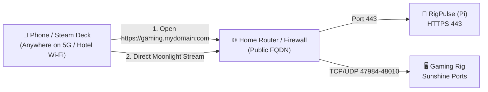

# FAQ & Troubleshooting

This guide covers common issues and questions regarding Wake-on-LAN, OpenSSH connectivity, Sunshine game streaming, and remote network access.

---

## ⚡ Wake-on-LAN (WOL) Issues

### 1. The PC wakes up right after being put to sleep, but fails to wake after a few hours or cold shutdown

This is the **#1 most common issue** with Wake-on-LAN on Windows desktops.

#### Cause A: Windows "Fast Startup" (Hybrid Sleep) cuts power to the NIC

Windows 10 and 11 feature "Fast Startup" (hybrid hibernation). When you shut down Windows, it puts the kernel into hibernation and powers off the motherboard PCIe bus and Ethernet controller completely, preventing the NIC from listening for magic packets.

**Fix**:

1. Open **Control Panel** → **Power Options**.
2. Click **Choose what the power buttons do** on the left.
3. Click **Change settings that are currently unavailable**.
4. Uncheck **Turn on fast startup (recommended)** and click **Save changes**.

#### Cause B: Motherboard ErP / EuP Energy Saving Mode

Modern motherboards have European Eco (ErP/EuP) modes enabled by default in BIOS/UEFI. These modes cut +5VSB standby rail power to sub-0.5W when the PC is off, depriving the Ethernet PHY controller of electricity.

**Fix**:

1. Reboot into your motherboard BIOS/UEFI (typically `Del` or `F2`).
2. Navigate to **Advanced** → **Power Management Setup** or **APM Configuration**.
3. Set **ErP / EuP Ready** to **Disabled**.
4. Ensure **Power On By PCI-E** or **Wake on LAN** is set to **Enabled**.

#### Cause C: Windows Network Adapter Energy Efficient Ethernet

1. Open **Device Manager** → **Network adapters** → right-click your Ethernet adapter → **Properties**.
2. Go to the **Advanced** tab:
    - Disable **Energy Efficient Ethernet** / **Green Ethernet**.
    - Set **Shutdown Wake-On-Lan** to **Enabled**.
    - Set **Wake on Magic Packet** to **Enabled**.
3. Go to the **Power Management** tab:
    - Check *Allow this device to wake the computer*.
    - Check *Only allow a magic packet to wake the computer*.

#### Cause D: Linux NetworkManager or TLP Power-Saving Disables WOL

On Linux gaming distributions (Bazzite, ChimeraOS, SteamOS, Arch, Ubuntu), power management daemons or NetworkManager can power down the Ethernet PHY or clear the magic packet flag upon suspend/shutdown:

1. **NetworkManager**: Ensure the connection profile permanently enables magic packet WOL:
   ```bash
   nmcli connection modify "Wired connection 1" 802-3-ethernet.wake-on-lan magic
   ```
2. **TLP / Power Management**: If your distro uses TLP for power saving, edit `/etc/default/tlp` and ensure:
   ```text
   WOL_DISABLE=N
   ```
3. **Verify Active State**: Check that the magic packet flag (`g`) is active before shutting down:
   ```bash
   sudo ethtool eth0 | grep Wake-on
   # Should output: Wake-on: g
   ```

---

### 2. Can I wake my PC over Wi-Fi (WoWLAN)?

Technically, some Wi-Fi cards support Wake-on-Wireless-LAN (WoWLAN), but it is notoriously unreliable:

- Most Wi-Fi routers disassociate inactive wireless clients after a few minutes of inactivity.
- Standby power to PCIe/M.2 Wi-Fi cards is rarely sustained in deep S5 shutdown.

**Recommendation**: Connect your gaming rig via an **Ethernet cable** directly to your switch or router for 100% reliable WOL and zero-jitter game streaming.

---

### 3. Can I send Wake-on-LAN packets over the Internet or across subnets?

Standard Wake-on-LAN packets are layer-2 Ethernet broadcast frames (`FF:FF:FF:FF:FF:FF`). They **cannot cross routers, internet gateways, or VPN tunnels** by default.

**Why RigPulse solves this**:
RigPulse runs on an always-on companion device (Raspberry Pi, mini PC, NAS, or home server) connected to the **same local subnet as your gaming rig**. You access RigPulse's web interface over HTTPS or VPN; RigPulse then injects the raw layer-2 UDP broadcast packet directly onto the local LAN wire.

---

## 🔒 OpenSSH & Agent Troubleshooting

### 1. `Permission denied (publickey)` when testing SSH from the companion server

#### Cause A: OpenSSH permissions on Windows

Windows OpenSSH is extremely strict regarding file permissions on `administrators_authorized_keys` or `authorized_keys`. If permission inheritance is enabled, OpenSSH will silently ignore the key file.

**Fix for Administrator accounts**:
```powershell
# Reset permissions on administrators_authorized_keys
icacls.exe "C:\ProgramData\ssh\administrators_authorized_keys" /inheritance:r /grant "Administrators:F" /grant "SYSTEM:F"
Restart-Service sshd
```

#### Cause B: Wrong authorized_keys file used on Windows

- If the remote Windows user is an **Administrator**, Windows OpenSSH ignores `C:\Users\<user>\.ssh\authorized_keys` and exclusively reads `C:\ProgramData\ssh\administrators_authorized_keys`.
- If the remote Windows user is a **Standard User**, OpenSSH reads `C:\Users\<user>\.ssh\authorized_keys`.

#### Cause C: OpenSSH directory and file permissions on Linux

Linux OpenSSH (`sshd`) enforces strict ownership and permission checks (`StrictModes` enabled by default). If your home directory or `.ssh` folder is group- or world-writable, SSH will reject public-key authentication with `Permission denied (publickey)`:

**Fix**:
```bash
# Ensure correct ownership (replace gamer with your username)
sudo chown -R gamer:gamer ~/.ssh

# Set strict POSIX directory and key permissions
chmod 700 ~/.ssh
chmod 600 ~/.ssh/authorized_keys
```

---

### 2. RigPulse displays "SSH starting..." and doesn't update metrics

1. Check if the target machine has finished booting the operating system and has acquired an IP address.
2. Verify that the OpenSSH daemon is running and set to automatic startup:
   - **Windows**:
     ```powershell
     Get-Service sshd | Select-Object -Property Name, StartType, Status
     ```
   - **Linux**:
     ```bash
     sudo systemctl status sshd
     # If stopped, enable and start immediately:
     sudo systemctl enable --now sshd
     ```
3. Test SSH connectivity manually from your companion server:
   ```bash
   ssh -i web/ssh/id_ed25519 -p 22 gamer@192.168.1.100 capabilities
   ```

---

### 3. Linux `sudoers` permission denied for Sleep, Poweroff, or Sunshine controls

If Wake-on-LAN and telemetry work, but clicking **SLEEP**, **SHUTDOWN**, or **Restart Sunshine** returns an error:

#### Cause: Missing or incorrect NOPASSWD sudoers rule

The RigPulse Linux agent runs as your standard user (e.g. `gamer`) and invokes system power commands via `sudo systemctl`. Without a passwordless sudoers entry, the command will fail or hang waiting for an interactive terminal password prompt.

**Fix**:

1. Edit the dedicated sudoers file using `visudo`:
   ```bash
   sudo visudo -f /etc/sudoers.d/rigpulse
   ```
2. Ensure the following line is present (replace `gamer` with your exact Linux username):
   ```text
   gamer ALL=(ALL) NOPASSWD: /usr/bin/systemctl poweroff, /usr/bin/systemctl suspend, /usr/bin/systemctl start sunshine, /usr/bin/systemctl stop sunshine, /usr/bin/systemctl restart sunshine
   ```
3. Set strict permissions on the sudoers drop-in:
   ```bash
   sudo chmod 0440 /etc/sudoers.d/rigpulse
   ```

---

## 🎮 Sunshine & Moonlight Streaming

### 1. Moonlight gives a black screen or "Failed to connect"

#### Cause A: Headless Rig without Display Attached

If your gaming rig is tucked away in a closet or basement without a physical monitor powered on, the OS may not initialize the GPU display pipeline, resulting in a black screen or 1024x768 fallback resolution.

**Fix**:

- **Hardware**: Plug in an inexpensive **HDMI or DisplayPort Dummy Plug (EDID Emulator)** (~5€ on Amazon). It fools the GPU driver into detecting a 4K 120Hz display.
- **Software**: Install a virtual display driver (e.g. **[Virtual-Display-Driver](https://github.com/itsmikethetech/Virtual-Display-Driver)** on Windows, or create a virtual display session via Gamescope / headless DRM on Linux).

#### Cause B: Sunshine service crashed after video driver update

When GPU drivers update, the Sunshine capture session can hang.
**Fix**: Simply click **Restart Sunshine** directly from the RigPulse dashboard. RigPulse will restart the Windows service or Linux systemd service cleanly over SSH without touching your display setup.

---

## 🌐 Remote Access (Away from Home)

How do I access RigPulse and stream games with Moonlight when traveling or outside my local network?

### Option A: Direct Public Domain & Port Forwarding (The "True Cloud Gaming" Experience — Zero VPN Friction)

This is the most seamless, professional setup. It mimics commercial services like GeForce NOW or Xbox Cloud Gaming: **no VPN client to connect to**, no background apps draining battery on your phone or Steam Deck, and zero MTU packet fragmentation for the lowest possible streaming latency.



#### 1. DNS & Domain Setup

Assign a public domain or Dynamic DNS (e.g. `gaming.yourdomain.com` or DuckDNS / Cloudflare) pointing to your home's public WAN IP.

#### 2. Router Port Forwarding Rules (NAT)

Configure the following forwarding rules in your home router / gateway:

| Service | Protocol | External Port | Destination LAN IP | Destination Port | Notes |
| :--- | :--- | :--- | :--- | :--- | :--- |
| **RigPulse** | TCP | `443` | `192.168.1.200` (Raspberry Pi) | `443` or `8000` | Reverse proxy with Let's Encrypt or Nginx/Caddy |
| **Sunshine Control** | TCP | `47984`, `47989`, `48010` | `192.168.1.100` (Gaming PC) | Same | Stream handshake & discovery |
| **Sunshine Video/Audio** | UDP | `47998`, `47999`, `48000`, `48002`, `48010` | `192.168.1.100` (Gaming PC) | Same | High-speed real-time AV streaming channels |

!!! warning "CAUTION"
    **Ports to NEVER expose to the Internet**:

    - **Port 47990 (Sunshine Web Admin)**: Keep this strictly local.
    - **Port 22 (OpenSSH)**: RigPulse talks to your gaming PC over SSH **strictly within the local LAN**. The SSH bridge must never be exposed to WAN.
    - **Port 3389 (Windows RDP)**: Never expose raw RDP to the public internet.

#### 3. Update RigPulse Configuration (`web/config.php`)

Set your public domain so RigPulse displays the WAN latency sparkline and configures external links:
```php
'target' => [
    // ...
    'public_domain' => 'gaming.yourdomain.com',
],
'sunshine' => [
    'enabled'  => true,
    'wan_host' => 'gaming.yourdomain.com',
    // ...
],
```

#### 4. The Workflow

1. From any browser anywhere in the world, navigate to `https://gaming.yourdomain.com`.
2. Authenticate, tap **POWER ON**.
3. Watch the live boot progression and Sunshine port indicators turn green.
4. Launch Moonlight, select `gaming.yourdomain.com`, and enjoy low-latency 4K 120 FPS gaming instantly.
5. When done, tap **SLEEP** from the RigPulse HUD to suspend the machine.

---

### Option B: Tailscale (Easiest Setup — Zero Router Config)

If your home ISP uses CGNAT (Carrier-Grade NAT) and you cannot forward ports:

1. Install **Tailscale** on your Raspberry Pi (RigPulse companion) and your mobile device (phone, laptop, Steam Deck).
2. Access the RigPulse web dashboard via your Raspberry Pi's Tailscale IP (e.g. `http://100.x.y.z:8000`).
3. For Moonlight streaming: enable **Subnet Router** on your Raspberry Pi Tailscale node so you can reach your gaming rig's local IP address directly.

---

### Option C: Self-Hosted WireGuard or OpenVPN

Host a WireGuard server on your home router or Raspberry Pi. Once connected to your VPN tunnel, your mobile device behaves as if it were physically sitting on your home Wi-Fi.

---

### Option D: Cloudflare Tunnel (for RigPulse Web HUD only)
You can expose the RigPulse web dashboard securely through a Cloudflare Zero Trust Tunnel without opening port 443. 
*(Note: Cloudflare Tunnel supports HTTP/WebSockets for RigPulse, but does not route the UDP real-time video stream for Moonlight).*

---

## 🌡️ Hardware Telemetry & Sensor Issues

!!! tip "Linux Zero-Config Hardware Telemetry"
    On **Linux gaming distributions** (SteamOS, Bazzite, ChimeraOS, Arch, Ubuntu, Debian), the Linux kernel exposes CPU on-die DTS temperatures (`/sys/class/hwmon/` via `k10temp` for AMD Ryzen or `coretemp` for Intel Core), fan header speeds, and AMD/Intel GPU vitals (`/sys/class/drm/`) natively without any third-party background applications. NVIDIA GPUs are queried out-of-the-box via `nvidia-smi`. **The LibreHardwareMonitor setup described below is only necessary on Windows.**

### 1. CPU Temperature is permanently stuck at 20°C (or 25°C) on Windows

#### Why this happens

On virtually all consumer desktop motherboards (ASUS, MSI, Gigabyte, ASRock), the Windows ACPI WMI provider (`MSAcpi_ThermalZoneTemperature`) returns a **static, hardcoded dummy value** (`2932` deci-Kelvin = `20.0°C` or `2982` = `25.0°C`). Motherboard vendors do not wire internal CPU on-die DTS (Digital Thermal Sensor) registers into standard ACPI DSDT tables on desktop ATX platforms.

Windows itself does not provide any native user-space API to read CPU MSRs (Model-Specific Registers) like AMD Ryzen `Tctl/Tdie` or Intel `Core DTS`.

#### The Fix: LibreHardwareMonitor

Run [LibreHardwareMonitor](https://github.com/LibreHardwareMonitor/LibreHardwareMonitor) in the background with local telemetry publishing enabled:

1. Download and extract **LibreHardwareMonitor** (run `LibreHardwareMonitor.exe` as Administrator).
2. **For LibreHardwareMonitor v0.9.5+**:
    - Go to **Options** → **Remote Web Server** → Click **Run** (default port `8085`).
    - *(Note: WMI was removed in v0.9.5+ in favor of this built-in high-performance local JSON server. Once started, LibreHardwareMonitor persists the running state in its config file and automatically relaunches the web server on every reboot).*
3. **For older versions (≤ v0.9.4) or OpenHardwareMonitor**:
    - Go to **Options** → **WMI** → Check **Enable WMI**.
4. Check **Run On Windows Startup** and **Minimize to System Tray**.
5. **(Recommended for Gaming)**:
    - **Low CPU Priority**: Set permanent Below Normal priority via `New-Item -Path "HKLM:\SOFTWARE\Microsoft\Windows NT\CurrentVersion\Image File Execution Options\LibreHardwareMonitor.exe\PerfOptions" -Force; Set-ItemProperty -Path "..." -Name "CpuPriorityClass" -Value 5 -Type DWord`.
    - **Uncheck Unused Sensors**: In the **Hardware** menu, uncheck **RAM**, **Storage**, and **Network** (leave only Mainboard/CPU and GPU).
    - **Update Interval**: In **Options** → **Update Interval**, change from `1s` to `2s` or `3s`.
6. The RigPulse agent will immediately query `http://127.0.0.1:8085/data.json` (or WMI) and stream true, dynamic CPU temperatures (e.g. 35°C idle, 72°C gaming) instead of the static dummy reading.

---

### 2. Fan speed (%) displays 'N/A' or '—'

Windows has **no built-in API or performance counter for motherboard fan headers** (CPU_FAN, PUMP_FAN, CHA_FAN).

- **For NVIDIA GPUs**: GPU fan percentage is read natively via `nvidia-smi`.
- **For CPU Fans & AMD/Intel GPU Fans**: Enabling **LibreHardwareMonitor** (with Remote Web Server or WMI enabled as above) reads motherboard Super I/O chips (Nuvoton, ITE, Fintek) and exposes fan speeds and control percentages directly to the RigPulse agent.

---

### 3. GPU Power (Watts) or Clock Frequency displays 'N/A' after waking from Sleep

#### Why this happens

On Windows 11 with NVIDIA drivers in the **581.xx to 595.xx** series, a known driver bug affects the **NVML** (*NVIDIA Management Library*) power telemetry subsystem during ACPI S3 sleep/resume transitions. When the system wakes up, `nvidia-smi` returns `[Not Supported]` for `power.draw`, and external tools relying on NVML (like LibreHardwareMonitor or HWiNFO) also lose access to the GPU power sensor.

#### The Fixes

1. **Update your NVIDIA Driver**: NVIDIA addressed this sensor reinitialization issue in driver versions **596.36 and newer**. Updating via the NVIDIA App or GeForce Experience to the latest Game Ready / Studio driver permanently fixes the issue.
2. **Disable Windows "Fast Startup"**: In **Control Panel** → **Power Options** → **Choose what the power buttons do**, uncheck **Turn on fast startup**.
3. **Instant Driver Reset (without rebooting)**: If your PC just woke from sleep and power draw is stuck, press:
   <kbd>Win</kbd> + <kbd>Ctrl</kbd> + <kbd>Shift</kbd> + <kbd>B</kbd>
   This restarts the Windows Graphics / WDDM stack and immediately wakes the NVML sensors.


